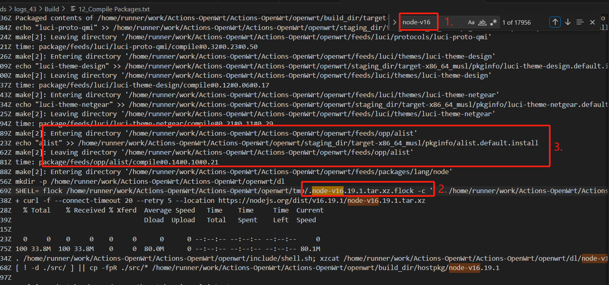

# Github Action云编译磁盘不足、编译超时问题解决方案

## 1. 超时原因
根据[Lean's OpenWrt Issue区](https://github.com/coolsnowwolf/lede/issues?q=is%3Aissue+%E4%BA%91%E7%BC%96%E8%AF%91%E8%B6%85%E6%97%B6)大佬[EnnawYang](https://github.com/coolsnowwolf/lede/issues/11038#issuecomment-1486089183)和[Gabrielxzx](https://github.com/coolsnowwolf/lede/issues/11605#issuecomment-1774006018)的描述，结合[stupidloud](https://github.com/coolsnowwolf/lede/pull/7796)大佬的PR，编译超时主要有两个原因

1. `Toolchain`编译工具链会消耗一个多小时。`Toolchain`是可以复用的
2. 部分插件需要使用`Node`环境编译，非常耗时。编译时可以去掉，编译完成后再单独安装

## 2. 超时解决方案
针对这两个问题的解决方案
1. 将`Toolchain`缓存起来，后面编译时引用前面编译好的`Toolchain`，具体脚本可以参考大佬[Haiibo](https://github.com/haiibo/OpenWrt)的脚本。（[stupidloud](https://github.com/coolsnowwolf/lede/pull/7796)大佬的PR似乎不生效，不知道是不是我的使用有问题）
2. 去掉需要`Node`环境编译的插件，常用的有`unblockmusic` 和 `alist`

把 `Alist` 和 `Unblockmusic` 注释掉，在所在行前面加 `#` 或者 把 `=` 号后的 `y`(yes) 改为 `n`(no)
```shell
# 修改前
CONFIG_PACKAGE_luci-app-alist=y
CONFIG_PACKAGE_luci-app-unblockmusic=y

# 修改后
CONFIG_PACKAGE_luci-app-alist=n
CONFIG_PACKAGE_luci-app-unblockmusic=n
```
实测一次编译从超时（超过6小时）变为3小时左右，顺便磁盘的占用也会下降很多

## 3. 磁盘空间不足
编译前删除不需要的工具包，参考 [P3TERX](https://github.com/P3TERX/Actions-OpenWrt) 和 [Haiibo](https://github.com/haiibo/OpenWrt) 大佬的脚本

```shell
- name: Initialization environment
  env:
    DEBIAN_FRONTEND: noninteractive
  run: |
    docker rmi `docker images -q`
    sudo rm -rf /etc/apt/sources.list.d/* /usr/share/dotnet /usr/local/lib/android /opt/ghc /etc/mysql /etc/php
    sudo -E apt-get -y purge azure-cli* docker* ghc* zulu* hhvm* llvm* firefox* google* dotnet* aspnetcore* powershell* openjdk* adoptopenjdk* mysql* php* mongodb* moby* snap* || true
    sudo -E apt-get -qq update
    sudo -E apt-get -qq install libfuse-dev $(curl -fsSL git.io/depends-ubuntu-2204)
    sudo -E apt-get -qq autoremove --purge
    sudo -E apt-get -qq clean
    sudo timedatectl set-timezone "$TZ"
    sudo mkdir -p /workdir
    sudo chown $USER:$GROUPS /workdir
```

## 4. 识别编译是否包含【需要Node环境编译的插件】的方法
1. 下载编译日志压缩包（编译详情右上角齿轮），日志文件压缩包超过`1M`基本可以确定使用了`Node`
   - 在包含`alist`时，日志压缩包`8M+`，解压后`130M+`
   - 去掉`alist`后，日志压缩包`120k`，解压后`500k`
2. 打开日志文件，搜索关键字`node-v` + 版本号，例如目前编译使用的node版本为: `node-v16.19.1`，不知道版本号直接搜`node-v`即可
   - 定位到第一个 `node-v16.19.1` 出现的位置，往上翻第一个插件就是使用`node`编译的

例如下面例子：



可以看到 `node-v` 一共出现了近 **1.8w** 次，而第一次出现是在`alist`插件的下方，可以确定是`alist`编译用到了`node-v16`，去掉即可。

如果实在不会，安装一个[iStoreOS](https://www.istoreos.com/)，把可以从`iStore`安装的插件全部删除掉

## 5. 其他编译报错（警告）

正常插件编译成功是每个插件只输出一行日志的，如果**日志文件很大，内容格式杂乱**，说明有插件编译出错了

定位问题**不要从下面往上翻**，有些异常日志会非常大，从下面翻会看花眼，从上面往下翻，找到错误队列开始的位置

如下面编译日志示例：
```shell
 make[2] -C feeds/sml/luci-app-passwall compile
 make[2] -C feeds/sml/luci-app-passwall2 compile
 make[2] -C package/kernel/mac80211 compile
 make[2] -C package/lean/autosamba compile
 make[2] -C package/system/urandom-seed compile
 make[2] -C package/system/fstools compile
 make[2] -C feeds/luci/applications/luci-app-firewall compile
 make[2] -C feeds/luci/modules/luci-base compile
 make[2] -C feeds/luci/libs/rpcd-mod-rrdns compile
 make[2] -C package/network/services/uhttpd compile
 make[2] -C package/libs/uclient compile
 make[2] -C feeds/luci/applications/luci-app-airplay2 compile
 make[2] -C feeds/packages/net/uwsgi compile
 make[2] -C feeds/packages/net/ddns-scripts compile
 make[2] -C feeds/packages/utils/smartmontools compile
 make[2] -C feeds/packages/utils/ttyd compile
 make[2] -C feeds/luci/applications/luci-app-filetransfer compile
 make[2] -C feeds/luci/applications/luci-app-frpc compile
 make[2] -C feeds/luci/applications/luci-app-frps compile
 make[2] -C feeds/luci/applications/luci-app-minidlna compile
 make[2] -C feeds/luci/applications/luci-app-nfs compile
 make[2] -C feeds/luci/applications/luci-app-nps compile
 make[2] -C feeds/luci/applications/luci-app-pptp-server compile
 make[2] -C feeds/packages/net/qBittorrent compile
 make[2] -C feeds/luci/applications/luci-app-rclone compile
 make[2] -C feeds/packages/net/transmission-web-control compile
 make[2] -C feeds/luci/applications/luci-app-ttyd compile
 make[2] -C feeds/luci/applications/luci-app-uhttpd compile
 make[2] -C feeds/luci/libs/luci-lib-ipkg compile
 make[2] -C feeds/luci/modules/luci-newapi compile
 make[2] -C feeds/packages/net/adguardhome compile
 make[2] -C feeds/opp/luci-app-filebrowser compile
 make[2] -C feeds/opp/luci-app-ikoolproxy compile
 make[2] -C package/system/procd compile
 make[2] -C package/system/opkg compile
 make[2] -C feeds/sml/luci-app-ssr-plus compile
 make[2] -C package/kernel/mt76 compile
 make[2] -C package/lean/automount compile
 make[2] -C package/lean/ddns-scripts_aliyun compile
 make[2] -C package/lean/ddns-scripts_dnspod compile
 make[2] -C package/network/ipv6/6in4 compile
 make[2] -C package/base-files compile
 make[2] -C feeds/luci/modules/luci-mod-admin-full compile
 make[2] -C feeds/luci/applications/luci-app-adbyby-plus compile
 make[2] -C feeds/packages/net/nginx compile
 make[2] -C feeds/luci/applications/luci-app-ddns compile
 make[2] -C feeds/luci/applications/luci-app-diskman compile
 make[2] -C feeds/luci/applications/luci-app-dockerman compile
 make[2] -C feeds/luci/applications/luci-app-mwan3 compile
 make[2] -C feeds/luci/applications/luci-app-transmission compile
 make[2] -C feeds/opp/luci-app-adguardhome compile
 make[2] -C feeds/opp/taskd compile
 make[2] -C package/lean/ipv6-helper compile
 make[2] -C feeds/luci/collections/luci compile
 make[2] -C feeds/packages/net/ariang compile
 make[2] -C feeds/luci/applications/luci-app-autoreboot compile
 make[2] -C feeds/luci/applications/luci-app-kodexplorer compile
 make[2] -C feeds/luci/applications/luci-app-mwan3helper compile
 make[2] -C feeds/luci/applications/luci-app-syncdial compile
 make[2] -C feeds/opp/luci-lib-taskd compile
 make[2] -C package/lean/default-settings compile
 make[2] -C feeds/luci/applications/luci-app-aria2 compile
 make[2] -C feeds/opp/luci-app-store compile
 make[2] -C feeds/luci/applications/luci-app-qbittorrent compile
WARNING: Makefile 'package/feeds/opp/luci-app-wechatpush/Makefile' has a dependency on 'wrtbwmon', which does not exist
make[2]: Entering directory '/home/runner/work/Actions-OpenWrt/Actions-OpenWrt/openwrt/scripts/config'
make[2]: 'conf' is up to date.
make[2]: Leaving directory '/home/runner/work/Actions-OpenWrt/Actions-OpenWrt/openwrt/scripts/config'
 make[1] package/index
```

可以看到前面插件编译都很正常，到 `luci-app-wechatpush` 时出现了问题
1. 正常编译成功的插件都是 ` make[2] -C feeds` 或 ` make[2] -C package` 开头且格式统一
2. 而在编译`luci-app-wechatpush`时，格式明显和正常的不一样，从描述看是缺少依赖` 'wrtbwmon'`。
3. 虽然只是一个警告消息，不会导致固件整体编译失败，但是定位导致编译失败问题的方法也是类似的

```bash
WARNING: Makefile 'package/feeds/opp/luci-app-wechatpush/Makefile' has a dependency on 'wrtbwmon', which does not exist
make[2]: Entering directory '/home/runner/work/Actions-OpenWrt/Actions-OpenWrt/openwrt/scripts/config'
make[2]: 'conf' is up to date.
make[2]: Leaving directory '/home/runner/work/Actions-OpenWrt/Actions-OpenWrt/openwrt/scripts/config'
 make[1] package/index
```

## 6. 最后
以上为本人根据各位大佬的描述，多次在线编译的得出的结论，分享出来供大家参考，并非专业人士，如有错漏，还请勿喷。
